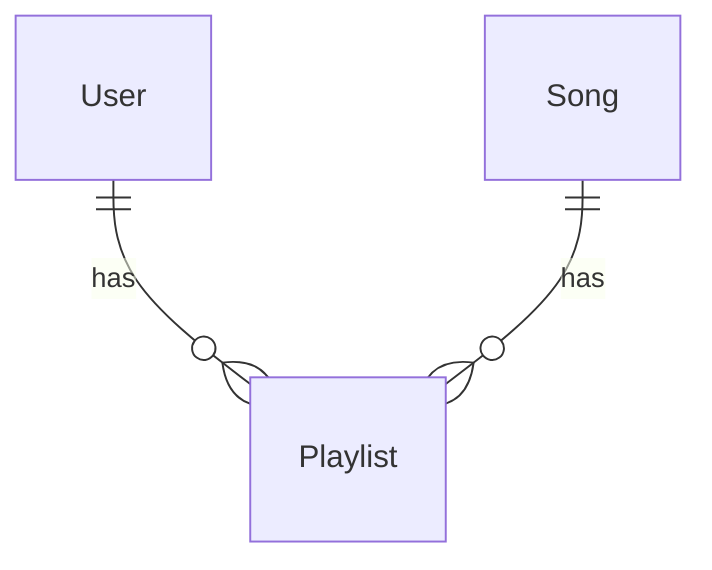
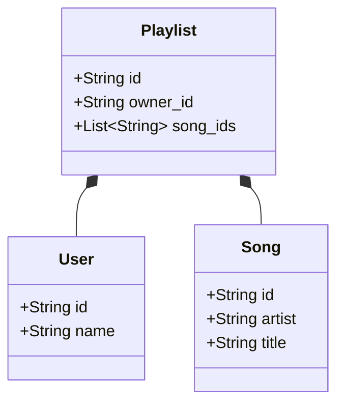
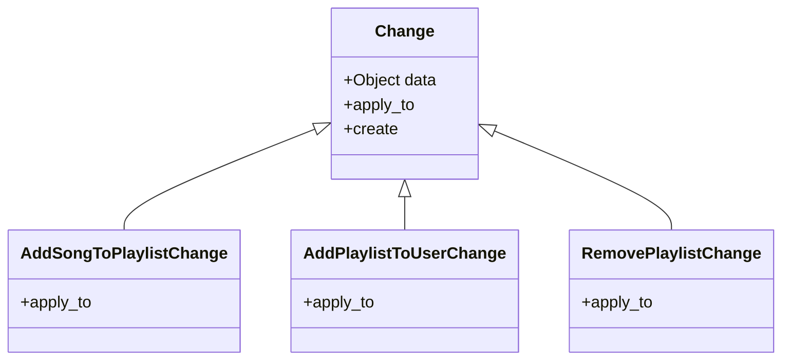

# Playlistify

Manage your spotify (or compatible) playlists directly from your console.

## About

This is a solution for [this coding challenge](https://gist.github.com/vitchell/a081703591116bab7e859cc000c98495)
powered by Ruby v3.

## Project Requirements

### Application

The input JSON file consists of a set of `users`, `songs`, and `playlists`
that are part of an online music service: [spotify.json](https://gist.githubusercontent.com/vitchell/fe0b1cb51e158058fb1b9d827584d01f/raw/f00f4d94d9d87b0d928bb3766a2667fb502d7407/spotify.json).

- [x] Ingests `spotify.json`
- [x] Ingests a `changes file`, which can take whatever form you like (we use
  `changes.json` in our example, but you’re free to name it whatever, and format
  it as text, YAML, CSV, or whatever)
- [x] Outputs `output.json` in the same structure as `spotify.json`, with the
  changes applied. The types of changes you need to support are enumerated below

### Features
- [x] Add an existing song to an existing playlist
- [x] Add a new playlist for an existing user; the playlist should contain at
  least one **existing** song
- [x] Remove an existing playlist

### README.md
- [x] Explains how to use your application and a way to validate its output
- [x] Describes what changes you would need to make in order to scale this
  application to handle very large input files and/or very large changes files.
  Just describe these changes — please do not implement a scaled-up version of
  the application.
- [x] Includes any thoughts on design decisions you made that you think are
  appropriate.
- [x] Includes how long you spent on the project, and any other thoughts you
  might have or want to communicate.

### Notes
- Don’t worry about creating a UI, DB, server, or deployment as a part of the
  code you're writing.
- Your code should be executable on Mac or Linux.

## How do I use this?

### Installation

To run this project you need to have Ruby v3 installed. If you don't have it
installed, you can follow [this guide](https://www.ruby-lang.org/en/documentation/installation/).

### Usage

To use this application, open a terminal in the root of this project, then you
need to run it with a command with the following format:

```shell
ruby main.rb <input_file>.json <changes_file>.json <output_file>.json
```

E.g
```shell
ruby main.rb ./samples/spotify.json samples/changes.json samples/output.json
`````
### `changes.json` file

The `changes.json` file is a JSON file that contains a list of changes that we
want to apply to the `spotify.json` file. It's an array of objects with the
following format (all fields are required):

```json
[
  {
    "action": "add_song_to_playlist",
    "data": {
      "playlist_id": "1",
      "song_id": "5"
    }
  },
  {
    "action": "add_playlist_to_user",
    "data": {
      "user_id": "2",
      "playlist": {
        "id": "5",
        "owner_id": "2",
        "song_ids": ["2", "3", "4"]
      }
    }
  },
  {
    "action": "remove_playlist",
    "data": {
      "playlist_id": "3"
    }
  }
]
```

> **The changes will be applied in the order they are in the file!**

#### Actions

The `action` field can have one of the following values:
- `add_song_to_playlist`
- `add_playlist_to_user`
- `remove_playlist`

## Contributing

If you want to contribute to this project, feel free to clone it and submit a
pull request. I'll be happy to review it and merge it if it's good to go.
Following subsections will help you setup the project and run the tests.

### Setup

This is a simple Ruby project, so you just need to install the dependencies
and you're good to go.

```shell
bundle install
```

### Testing

If you want to run the tests, you can do so by running `rspec` in the root.

```shell
bundle exec rspec
```

## Problem Solving Walkthrough 🚶🏻‍♂️

### Entities relationships and attributes 🔗
The first thing I did was analyzing the `spotify.json` file and created
a [mermaid](https://mermaid-js.github.io/mermaid/#/) diagram to visualize the
relationships between the entities. This project consists of 3 entities: `User`,
`Song`, and `Playlist`. And the relationships between them are as follows:



As for their class diagram and attributes, I came up with the following:



With that, I need to keep in mind that we want to achieve the following:
- **Add an existing song to an existing playlist**
  - That is, add `song_id` to a `Playlist.song_ids` list
- **Add a new playlist for an existing user**
  -  In other words, create a new `Playlist` with existing user as `owner_id`
- Remove an existing playlist
  - Simply put, remove a `Playlist` from the output file

Cool! But how will we achieve that with the `changes` file? 🤔

Let's think about that.

### The `changes` file 👺

The `changes` file is a JSON file that contains a list of changes that we want
to apply to the `spotify.json` file. It looks like this:

```json
[
  {
    "action": "add_song",
    "playlist_id": "1",
    "song_id": "42"
  },
  {
    "action": "add_playlist",
    "playlist": {
      "id": "4",
      "owner_id": "3",
      "song_ids": ["6", "8", "11"]
    }
  },
  {
    "action": "remove_playlist",
    "playlist_id": "2"
  }
]
```

I decided to go with JSON as it's a simple format and it's easy to parse. Also,
it's a common format used in the web, so it's a good choice for this project.

The changes will be applied in the order they are in the file, so we need to
keep that in mind.

Also we talk about `change`, `change`, and `change`. So sounds like it makes
sense to create a `Change` class to represent a change.

### The `Change` class 🧙🏻‍♂️

The `Change` class will be responsible for applying the `changes` to the
output file. It will have the following attributes:



The `Change.create` method will be responsible for creating the appropriate
subclass based on the `action` field. And the `Change.apply_to` method will be
responsible for applying the change to the output file.

The inspiration for this is the Factory Method design pattern and I believe it
suits this project well.

### The `Playlistify` class 🎧

The `Playlistify` class will be responsible for ingesting all files,
applying the changes to the output file and writes the output file to disk.

## Final thoughts 🤔

It took me about 4 hours to complete this project. I had a lot of fun doing it
and I learned a lot as it's been a while since the last developed a command line
application.

### Changes to scale the application

I am not used to create applications that handle very large input files, so I
might say something silly, but I'll try my best.

Currently it reads the whole input and change files into memory, which is not
ideal for very large files as it might run out of memory, or have a very long
execution time.

We could use the MapReduce pattern as inspiration to solve this problem.
With that, split the input file into chunks and process them in parallel. Then
 merge the results into a single output file. On the other hand, we need to keep
in mind that the changes need to be applied in order, so we need to find a way
to do that. Maybe we could split the changes file into chunks per playlist and
user.

### Future improvements

- Make the script executable and add instructions on how to run it
- Add more validations, e.g, check if files are valid; check if song exist before
adding to playlist
- Add more documentation, e.g, add `@param` and `@return` to methods
- Add more file formats support, e.g, support CSV and YAML files
- Add `--help` flag to show instructions on how to use the script
